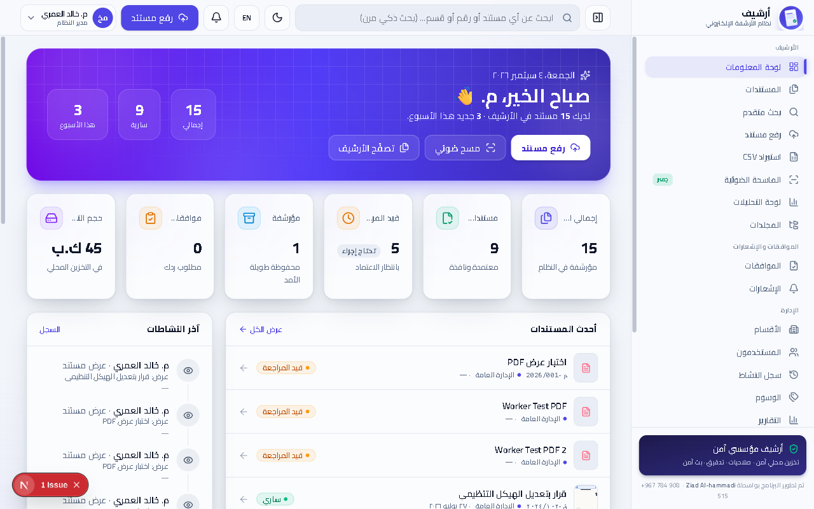

<div align="center">


# أرشيف — نظام الأرشفة الإلكترونية EDMS
# Archive — Electronic Document Management System (EDMS)

## 📌 مقدمة المشروع

**منصة أرشفة مؤسسية آمنة بواجهة عربية كاملة (RTL) مع دعم كامل للغة الإنجليزية (LTR)**
— من الماسح الضوئي إلى الإيداع الموثّق، تعمل على الويب وتُغلَّف كتطبيق سطح مكتب
للوصول إلى عتاد المسح المحلي.

## 📌 Project Introduction

**A secure institutional archiving platform with a full Arabic interface (RTL) and full English support (LTR)**
— from scanner to verified deposit, runs on the web and wraps as a desktop app
for local scan hardware access.

## 🌍 واجهة ثنائية اللغة

> زر `EN / ع` في الشريط العلوي (وشاشة الدخول) يبدّل فورياً بين العربية (RTL) والإنجليزية (LTR).

## 🌍 Bilingual UI

> Use the `EN / ع` button in the header (and login screen) to instantly switch between Arabic (RTL) and English (LTR).

## ⬇️ تحميل البرنامج — ويندوز 64-بت

<a href="https://github.com/zeiad6/Edms-archive/releases/download/v1.0.1/EDMS-Archive-1.0.1-Setup-x64.exe">

</a>

**[⬇️ تحميل مباشر: EDMS-Archive-1.0.1-Setup-x64.exe (المثبت)](https://github.com/zeiad6/Edms-archive/releases/download/v1.0.1/EDMS-Archive-1.0.1-Setup-x64.exe)**

> 🔄 **لديك الإصدار 1.0.0؟** شغّل المثبّت الجديد مباشرة — يُحدِّث البرنامج في مكانه
> ويحتفظ بقاعدة البيانات والمستندات كما هي.

· [📦 كل الإصدارات](https://github.com/zeiad6/Edms-archive/releases/latest)

> ⚠️ الحزمة **لنظام ويندوز 64-بت فقط**. عند أول تشغيل قد تظهر شاشة SmartScreen
> لأن البناء غير موقّع — اختر «المزيد من المعلومات» ثم «تشغيل على أي حال».

## ⬇️ Download — Windows 64-bit (x64)

**[⬇️ Direct download: EDMS-Archive-1.0.1-Setup-x64.exe (Installer)](https://github.com/zeiad6/Edms-archive/releases/download/v1.0.1/EDMS-Archive-1.0.1-Setup-x64.exe)**

> 🔄 **On 1.0.0?** Just run the new installer — it upgrades in place and keeps
> your database and documents untouched.

· [📦 All releases](https://github.com/zeiad6/Edms-archive/releases/latest)

> ⚠️ **Windows 64-bit only**. On first run SmartScreen may appear
> because the build is unsigned — choose “More info” then “Run anyway”.




[⬇️ التحميل](#️-تحميل-البرنامج--ويندوز-64-بت-windows-x64) · [التشغيل السريع](#-التشغيل) ·
[الميزات](#-الميزات) · [نافذة المسح](#-نافذة-المسح-من-الطابعة) ·
[سطح المكتب](#-تطبيق-سطح-المكتب) · [الأمان](#-الأمان) · [الاختبارات](#-الاختبارات)

</div>

---

## ✨ الميزات

| المجال | ما يقدمه النظام |
| --- | --- |
| 📊 **لوحة معلومات** | إحصاءات حية، توزيع الحالات والأقسام، أحدث المستندات، وموجز النشاط |
| 📄 **المستندات** | تصفح وبحث شامل (العنوان، الوصف، الرقم، **نص OCR**) مع فلاتر الحالة/القسم/النوع/المجلد |
| 👁️ **عارض آمن** | معاينة `inline` للصور و PDF و TXT/CSV دون حفظ محلي (`Cache-Control: no-store`) |
| 🖨️ **المسح من الطابعة** | نافذة مسح فردي/متعدد: قائمة الأجهزة، اللون، الدقة، ترتيب ومعاينة قبل الإيداع |
| 📷 **مسح الكاميرا** | التقاط مباشر + كشف باركود تلقائي (ZXing) يعبئ الرقم المرجعي |
| ✅ **الموافقات** | طلب / اعتماد / رفض مع إشعارات داخل التطبيق وسجل تدقيق |
| 💾 **النسخ الاحتياطي** | أرشيف ZIP مجزأ (`database`/`storage`/`scripts`/`config`) — للمدراء فقط |
| 👥 **الإدارة** | الأقسام، المستخدمون، المجلدات، الأنواع، الوسوم، وسجل النشاط الكامل |

> **النظام يُهيّئ نفسه تلقائياً**: عند أول تشغيل تُنشأ الجداول والبيانات التجريبية دون أي خطوة يدوية.

## ✨ Features

| Area | What the system provides |
| --- | --- |
| 📊 **Dashboard** | Live stats, status and department distribution, latest documents, activity summary |
| 📄 **Documents** | Full browse and search (title, description, number, **OCR text**) with status/department/type/folder filters |
| 👁️ **Secure viewer** | `inline` preview for images, PDF and TXT/CSV without local save (`Cache-Control: no-store`) |
| 🖨️ **Printer scanning** | Single/multi scan window: device list, color, DPI, ordering and preview before deposit |
| 📷 **Camera scan** | Live capture + automatic barcode detection (ZXing) filling the reference number |
| ✅ **Approvals** | Request / approve / reject with in-app notifications and audit log |
| 💾 **Backup** | Split ZIP archive (`database`/`storage`/`scripts`/`config`) — managers only |
| 👥 **Administration** | Departments, users, folders, types, tags, and full activity log |

> **Self-initializing system**: on first run tables and demo data are created automatically with no manual step.

---

## 🖨️ نافذة المسح من الطابعة

زر واحد **«مسح من الطابعة»** يفتح نافذة فرع المسح — فردي أو متعدد — ثم تُضاف الصفحات إلى
الواجهة الرئيسية، **ومن هناك فقط يتم الإيداع** في المستندات:

```
الطابعة (WIA) → نافذة المسح → الواجهة الرئيسية → الإيداع في الأرشيف
```

- **الأجهزة المتصلة**: سرد تلقائي للماسحات والطابعات متعددة الوظائف (USB/شبكة) مع تحديث.
- **خيارات المسح**: اللون (ألوان / رمادي / أسود وأبيض) والدقة (75 → 600 DPI).
- **المعرض بالترتيب**: كل مسح يُلحق بالترتيب، مع سحب وإفلات وأزرار تحريك.
- **تكبير وحذف**: ضغطة مزدوجة للتكبير، وحذف أي صورة بتأكيد مزدوج.
- **الإيداع الذكي**: صفحة واحدة تُحفظ كصورة، وعدة صفحات تُدمج تلقائياً في **ملف PDF واحد**
  يُبنى محلياً دون أي مكتبة خارجية أو اتصال بالإنترنت.
- **محاكاة المسح**: تعمل دائماً — تستخدم العتاد إن وُجد، وإلا تولّد صفحة عينة محلية.

## 🖨️ Printer Scan Window

One **“Scan from printer”** button opens the scan branch window — single or multi — then pages are added to
the main interface, **and only from there are they deposited** into documents:

```
Printer (WIA) → Scan window → Main interface → Archive deposit
```

- **Connected devices**: automatic listing of scanners and MFPs (USB/network) with refresh.
- **Scan options**: color (color / gray / black & white) and resolution (75 → 600 DPI).
- **Ordered gallery**: each scan appended in order, with drag-and-drop and move buttons.
- **Zoom and delete**: double-click to zoom, delete any image with double confirmation.
- **Smart deposit**: single page saved as image, multiple pages auto-merged into **one PDF file**
  built locally with no external library or internet connection.
- **Scan simulation**: always works — uses hardware if present, otherwise generates a local sample page.

---

## 🖥️ تطبيق سطح المكتب

يُغلَّف النظام عبر **Electron** (خادم Next.js مدمج + SQLite محلي + سكربت WIA):

- شريط عنوان مخصص (RTL، بدون إطار ويندوز) مع أزرار تصغير/تكبير/إغلاق.
- **إغلاق النافذة = تسجيل خروج**: يُمسح كوكي الجلسة عند الإغلاق، فتفتح النسخة التالية
  دائماً على شاشة تسجيل الدخول.
- مفتاح `AUTH_SECRET` فريد لكل تثبيت (يُولَّد عند أول إقلاع بتقييد `0600`).
- **كشف التحديثات تلقائياً**: عند نشر إصدار جديد على GitHub يظهر إشعار داخل التطبيق
  مع زر «الانتقال إلى التحميل» الذي يفتح صفحة التنزيل (بلا تثبيت صامت).

## 🖥️ Desktop App

The system is wrapped via **Electron** (embedded Next.js server + local SQLite + WIA script):

- Custom title bar (RTL, frameless) with minimize/maximize/close buttons.
- **Closing the window = logout**: session cookie is cleared on close, so the next launch
  always opens on the login screen.
- Unique `AUTH_SECRET` per installation (generated on first boot with `0600` restriction).
- **Automatic update check**: when a new release is published on GitHub an in-app notice appears
  with a “Go to download” button opening the download page (no silent install).

---

## 🧱 المعمارية

| الطبقة | التقنية |
| --- | --- |
| الواجهة والخادم | **Next.js 16** (App Router) + React 19 + Tailwind CSS 4 |
| قاعدة البيانات | **SQLite** عبر **libsql** + **Drizzle ORM** (`data/edms.db`) |
| كلمات المرور | **scrypt** (`node:crypto`) بصيغة `scrypt$N$r$p$salt$hash` |
| الجلسات | كوكي `edms_uid` موقّع **HMAC-SHA256** بمفتاح `AUTH_SECRET` |
| التخزين | ملفات على القرص (`storage/`) تُخدَم عبر مسار بث آمن يتحقق من الصلاحيات |
| OCR | **Tesseract** (عربي/إنجليزي) + استخراج نص PDF محلياً |
| الصلاحيات | RBAC (مدير / مشرف / موظف) + عزل المستندات السرية حسب القسم |
| التدقيق | جدول `audit_logs` يسجل كل عملية (عرض/تنزيل/رفع/تعديل/حذف/بحث/دخول) |

## 🧱 Architecture

| Layer | Technology |
| --- | --- |
| Frontend and server | **Next.js 16** (App Router) + React 19 + Tailwind CSS 4 |
| Database | **SQLite** via **libsql** + **Drizzle ORM** (`data/edms.db`) |
| Passwords | **scrypt** (`node:crypto`) as `scrypt$N$r$p$salt$hash` |
| Sessions | `edms_uid` cookie signed **HMAC-SHA256** with `AUTH_SECRET` |
| Storage | On-disk files (`storage/`) served via a secure streaming route with permission checks |
| OCR | **Tesseract** (Arabic/English) + local PDF text extraction |
| Permissions | RBAC (admin / manager / staff) + confidential-document isolation by department |
| Auditing | `audit_logs` table records every operation (view/download/upload/edit/delete/search/login) |

```
├── src/app            ← صفحات App Router + مسارات API
│   ├── api/scan       ← المسح (محاكاة/hardware/الأجهزة)
│   └── api/documents  ← بث الملفات الآمن + الإصدارات
├── src/components/scanner  ← الواجهة الرئيسية + نافذة المسح من الطابعة
├── src/actions        ← إيداع الممسوح (صورة/PDF) والموافقات
├── src/lib            ← scrypt، الجلسات، PDF المحلي، WIA، OCR
├── scripts/scan-wia.ps1    ← سائق المسح (WIA COM، بلا تعريفات خارجية)
└── electron/          ← غلاف سطح المكتب (main + preload)
```

```text
├── src/app            ← App Router pages + API routes
│   ├── api/scan       ← scanning (simulation/hardware/devices)
│   └── api/documents  ← secure file streaming + versions
├── src/components/scanner  ← main UI + printer scan window
├── src/actions        ← scanned deposit (image/PDF) and approvals
├── src/lib            ← scrypt, sessions, local PDF, WIA, OCR
├── scripts/scan-wia.ps1    ← scan driver (WIA COM, no external drivers)
└── electron/          ← desktop wrapper (main + preload)
```

---

## 🚀 التشغيل

```bash
npm install
npm run dev      # تطوير — http://localhost:3000
npm run build    # بناء إنتاجي
npm start        # تشغيل إنتاجي
```

## 🚀 Running

```bash
npm install
npm run dev      # development — http://localhost:3000
npm run build    # production build
npm start        # production run
```

## 👥 الحساب الافتراضي

عند أول تشغيل يُنشأ **حساب واحد** فقط:

| الحقل | القيمة |
| --- | --- |
| اسم المستخدم | `admin` |
| كلمة المرور | `12345678` |

> ⚠️ تغيير كلمة المرور **إجباري** عند أول دخول. بعده لا يعمل الثابت الأصلي إطلاقاً.
> بقية الحسابات تُنشأ من **الإعدادات ← المستخدمون**. لا توجد حسابات تجريبية أخرى،
> لأن أي حساب يُبذر بكلمة مرور منشورة في المستودع هو باب دخول مفتوح على كل تثبيت.

## 👥 Default Account

A fresh install seeds **one** account:

| Field | Value |
| --- | --- |
| Username | `admin` |
| Password | `12345678` |

> ⚠️ Changing the password is **enforced** on first sign-in. After that the
> original constant stops working. Create further accounts under
> **Settings → Users**. There are no other demo accounts on purpose: a seeded
> account whose password is published in this repository is an open door on
> every install.

---

## 🧪 الاختبارات

```bash
npm test                  # كل الاختبارات (vitest)
npm run test:critical     # المسارات الحرجة (backup/restore/scan/upload/documents/approvals)
npm run db:seed:check     # فحص عدّادات الجداول الأساسية
npm run lint              # فحص ESLint
npm run typecheck         # فحص TypeScript
npm run electron:pack     # تغليف تطبيق سطح المكتب
```

## 🧪 Tests

```bash
npm test                  # all tests (vitest)
npm run test:critical     # critical paths (backup/restore/scan/upload/documents/approvals)
npm run db:seed:check     # check core table counts
npm run lint              # ESLint check
npm run typecheck         # TypeScript check
npm run electron:pack     # package desktop app
```

---

## 🔐 الأمان

- جلسات موقعة HMAC بلا أسرار افتراضية (فشل صريح عند غياب `AUTH_SECRET` في التطوير).
- ملفات SVG/Office تُجبر على التنزيل ولا تُنفَّذ داخل origin التطبيق.
- البث `inline` للصور و PDF مع `SAMEORIGIN` و `no-store` — لا أثر على القرص المحلي.
- تدقيق كامل لكل عملية حساسة، وعزل الصلاحيات حسب القسم والسرية.

## 🔐 Security

- HMAC-signed sessions with no default secrets (explicit failure when `AUTH_SECRET` is missing in development).
- SVG/Office files are forced to download and never execute inside the app origin.
- `inline` streaming for images and PDF with `SAMEORIGIN` and `no-store` — no trace on local disk.
- Full audit of every sensitive operation, and permission isolation by department and confidentiality.

## ⚙️ متغيرات البيئة

| المتغير | الوصف |
| --- | --- |
| `AUTH_SECRET` | **إلزامي في الإنتاج** (≥32 حرفاً) — `node -e "console.log(require('crypto').randomBytes(32).toString('base64url'))"` |
| `DATABASE_URL` | افتراضياً `file:./data/edms.db` (يُنشأ تلقائياً) |
| `NEXT_PUBLIC_APP_URL` | عنوان النطاق الفعلي (لا `localhost` في الإنتاج) |
| `TESSERACT_PATH` | مسار Tesseract عند عدم اكتشافه (Linux: `sudo apt install tesseract-ocr tesseract-ocr-ara`) |
| `EDMS_DATA_DIR` / `EDMS_STORAGE_DIR` / `EDMS_SCRIPTS_DIR` | تُضبط تلقائياً من غلاف Electron |

## ⚙️ Environment Variables

| Variable | Description |
| --- | --- |
| `AUTH_SECRET` | **Required in production** (≥32 chars) — `node -e "console.log(require('crypto').randomBytes(32).toString('base64url'))"` |
| `DATABASE_URL` | Defaults to `file:./data/edms.db` (auto-created) |
| `NEXT_PUBLIC_APP_URL` | Real domain URL (not `localhost` in production) |
| `TESSERACT_PATH` | Tesseract path when not auto-detected (Linux: `sudo apt install tesseract-ocr tesseract-ocr-ara`) |
| `EDMS_DATA_DIR` / `EDMS_STORAGE_DIR` / `EDMS_SCRIPTS_DIR` | Set automatically by the Electron wrapper |

## 📦 النشر (إنتاج)

1. `npm ci` ثم `npm run build` ثم `npm start` (منفذ 3000).
2. شغّل **عملية واحدة فقط** — SQLite ملفية لا تتحمل كتابة متزامنة من عمليات متعددة.
3. ضع الخادم خلف وكيل عكسي (Nginx/Caddy) يُنهي TLS.
4. النسخ الاحتياطي: أوقف الخادم، انسخ `data/edms.db` + `storage/`، ثم أعد التشغيل.

## 📦 Deployment (production)

1. `npm ci` then `npm run build` then `npm start` (port 3000).
2. Run **a single process only** — file-based SQLite cannot handle concurrent writes from multiple processes.
3. Put the server behind a reverse proxy (Nginx/Caddy) terminating TLS.
4. Backup: stop the server, copy `data/edms.db` + `storage/`, then restart.

---

<div align="center">

**تم التطوير بواسطة Ziad Al-hammadi** · نظام الأرشفة الإلكترونية EDMS · Developed by Ziad Al-hammadi

</div>
